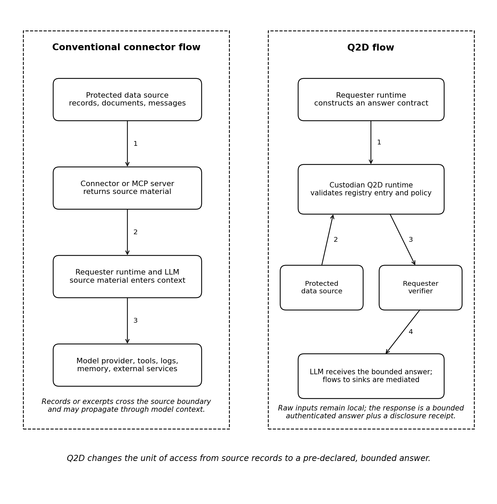
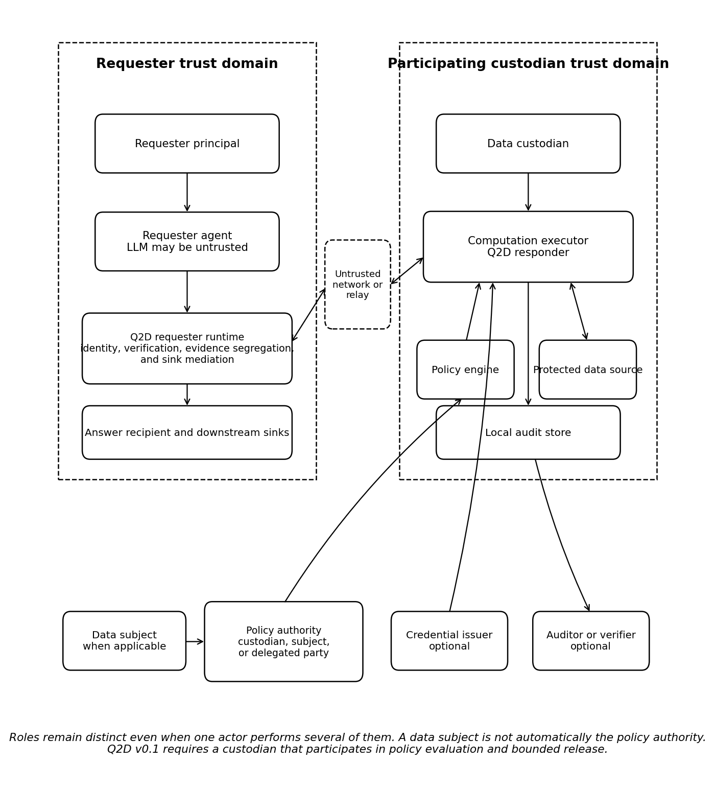
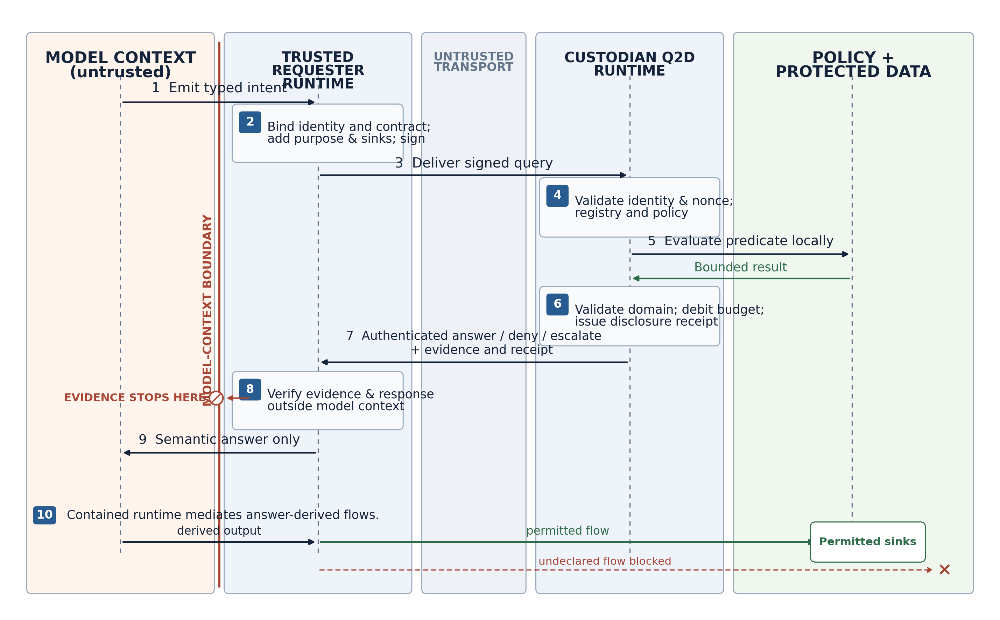

**Q2D Protocol Project**  
[q2d.dev](https://q2d.dev) · [github.com/q2d-protocol/q2d](https://github.com/q2d-protocol/q2d)

**Document status.** Experimental technical report and protocol proposal. This is not an official Model Context Protocol or Agent2Agent specification. Q2D version 0.1 is pre-release, and this report does not claim a completed Phase 1 implementation or empirical results.

**Publication posture.** Q2D is an open-source protocol project. The project is not pursuing patents on the mechanisms described here and intends this report as an open technical disclosure. Reference implementation code is licensed under Apache-2.0.

**Scope of this release.** This is a design report. Sections 12 and 13 state implementation status and evaluation method prospectively; measured results are required before the manuscript can claim an evaluated systems or privacy contribution.

**Versioning note.** Report drafts and protocol versions are numbered independently. Technical Report Draft 0.2.1 describes the pre-release Q2D protocol version 0.1.

```{=openxml}
<w:p><w:r><w:br w:type="page"/></w:r></w:p>
```

# Abstract {.unnumbered}

AI agents are commonly connected to files, databases, messages, application programming interfaces, and other protected sources through standardized tool and data interfaces. Yet many tasks require only a bounded decision—a boolean, a finite enum, a time slot, a small set, or another constrained result—while conventional connector flows expose records or document excerpts to the requesting agent and often to the language model itself. This broadens the attack surface for prompt injection, accidental retention, unauthorized onward transfer, and cumulative inference.

This report presents **Query-to-Data (Q2D)**, a transport-neutral protocol for policy-bound, least-disclosure answers over data held by a participating custodian. A requester runtime constructs a signed **answer contract** that binds a versioned predicate, purpose, intended recipient, permitted downstream sinks, freshness requirements, and a bounded response domain. A custodian-side computation executor verifies the request against a custodian-pinned predicate registry, resolves applicable custodian and subject-mediated policy, evaluates the predicate locally, validates the result against the registered domain, and returns a bounded authenticated answer with a disclosure receipt. An optional contained-requester profile verifies signatures or proofs outside model context and mediates answer-derived flows to approved sinks, treating model endpoints, tools, memory, logs, and external services as explicit destinations.

Q2D does not claim novelty for source-side predicate APIs themselves. Its contribution is a portable protocol around them: the requester commits to the answer contract before policy evaluation; the responder independently verifies the predicate and domain; the receipt binds purpose, recipient, sinks, policy, and budget debit to one exchange; and the same semantics can be carried over MCP, A2A, or direct HTTPS. Version 0.1 begins with authenticated answers and a coarse disclosure-capacity budget. It does not establish the truth of self-asserted inputs, prove the honesty of declared purpose, or provide a formal inference-privacy guarantee.

**Keywords:** AI agents; data minimization; privacy engineering; policy enforcement; prompt injection; information-flow control; MCP; A2A; selective disclosure; authenticated computation.

# Executive Summary {.unnumbered}

The central Q2D claim is narrow:

> A participating data custodian can answer a pre-declared, bounded question without exposing the underlying source records through the Q2D interface, and can bind that answer to an authenticated request, policy decision, and disclosure receipt.

The optional end-to-end claim is conditional:

> When the requester also uses a conforming contained runtime that mediates every relevant model, tool, log, memory, and network sink, the machine pipeline can restrict answer-derived flows to destinations authorized by the answer contract and local policy.

A hand-written endpoint such as `can_eat_here()` can already compute at the source and return one decision. Q2D is not an attempt to patent or rename that familiar pattern. The interoperability gap appears when independently developed requesters and custodians need to agree on the exact predicate, response domain, purpose, recipient, sinks, policy evidence, retry semantics, and cumulative disclosure state. Q2D standardizes that exchange.

Four elements carry most of the design’s distinct value:

1. **Pre-evaluation commitment.** The requester signs the predicate, purpose, recipient, sinks, and requested release shape before the custodian evaluates policy or private data.
2. **Responder-owned domain validation.** The custodian resolves the canonical response domain from a trusted, versioned predicate registry rather than accepting the requester’s description of maximum leakage.
3. **Exchange-bound accountability.** The response receipt binds the request, policy version, authorized contract, assurance profile, and disclosure-capacity debit to one authenticated exchange.
4. **Portable composition.** The same core semantics can be exposed as a protected MCP capability, an A2A exchange, or a direct HTTPS protocol, with an optional requester runtime that keeps evidence outside model context.

Q2D version 0.1 is limited to **participating custodians**: the protected source is operated by a custodian whose runtime is authorized to evaluate the query and release the answer. A data subject may be a policy authority, one input to policy, or neither, depending on the deployment. Q2D does not assume that a person can unilaterally control every piece of information about them in someone else’s system.

The Phase 1 registry bootstrap is deliberately simple: a custodian pins a signed application-distributed manifest and rejects unknown predicate versions or registry digests. Federation and automatic reconciliation between registries are deferred. The initial assurance mechanism is an **authenticated answer** signed by the custodian runtime. Issuer-backed credentials, verifiable computation, and attested-use release remain independent future profiles rather than rungs in a single security ladder.

# Claims and Non-Claims {.unnumbered}

| Q2D can claim, under stated assumptions | Q2D does not claim |
|---|---|
| Raw private inputs need not cross the participating custodian’s Q2D interface for a bounded query. | The underlying facts are true, complete, current, or independently verified. |
| A conforming responder validates the requested predicate and answer domain against a versioned registry entry. | A requester’s declared purpose is honest or enforceable after information reaches a human. |
| A Phase 1 response is authenticated by the computation executor or custodian identity profile. | A signed answer is a zero-knowledge proof or proof that the correct source data was used. |
| The query and receipt bind the purpose, answer recipient, permitted sinks, freshness, and response shape to one exchange. | A released answer can be revoked from a recipient who has already learned it. |
| Denial normalization can reduce explicit absent-data and policy-denial oracles. | Denials are indistinguishable across timing, traffic analysis, state changes, or all side channels. |
| A disclosure-capacity budget can limit the nominal capacity of repeated finite-domain answers. | The budget is a formal differential-privacy or posterior-inference guarantee. |
| A contained requester runtime can keep evidence outside model context and mediate answer-derived flows. | Labels alone stop leakage when any relevant sink, log, memory path, or side channel is unmediated. |
| The architecture can support GDPR data-minimization and accountability controls. | The protocol determines controller roles, lawful basis, consent validity, or overall GDPR compliance. |

```{=openxml}
<w:p><w:r><w:br w:type="page"/></w:r></w:p>
```

# Introduction

AI systems increasingly act through tools rather than only generating text. The Model Context Protocol (MCP) standardizes connections between AI applications and external data sources and tools, while the Agent2Agent (A2A) protocol standardizes communication between independent agent systems [@mcp-spec; @mcp-architecture; @a2a-spec]. These protocols make agent integrations easier to build and interoperate. They do not, by themselves, change a common authorization pattern: the agent is granted access to source material, the source material enters an application or model context, and the application is expected to use it appropriately.

That pattern is often disproportionate to the task. Consider a dinner-planning agent deciding whether a proposed menu is compatible with a friend’s dietary constraints. The useful output may be a boolean. A conventional integration may nevertheless retrieve a contact record, email message, health note, or free-text preference into the requester’s context. The same mismatch appears in enterprise settings:

- an underwriting agent needs to know whether a threshold is met, not receive an entire customer file;
- a scheduling agent needs the first mutually available slot, not every participant’s calendar;
- an HR agent needs an eligibility decision, not a complete employment history;
- a purchasing agent needs confirmation that a vendor satisfies a control, not every supporting document;
- a care-coordination agent needs a permitted next action, not all underlying clinical notes.

The problem is not simply that the requester has too many database privileges. It is that the system’s *unit of access* is frequently a record, document, search result, or tool response when the task’s legitimate output is much smaller. Database views, row-level security, and attribute-based access control can narrow which rows or fields a caller may read [@postgres-rls; @nist-abac]. Fine-grained authorization standards can also bind structured details to a grant [@rfc9396; @rfc9635; @uma2]. None of these mechanisms, by itself, defines a portable cross-agent contract for the exact answer that may be learned, a responder-verified answer domain, a disclosure receipt, cumulative answer accounting, and downstream machine sinks.

A purpose-built predicate API is therefore Q2D’s hardest baseline, not its novelty claim. An application can expose `can_eat_here(menu)` and return `true` without Q2D. Q2D asks what must be standardized when that predicate is called across organizational and agent boundaries: who authenticated the request, which version and domain the custodian accepted, which authorities approved the release, what purpose and recipient were bound to it, what cumulative disclosure state changed, and where the result may flow next.

Prompt injection makes this mismatch a security issue as well as a privacy issue. Agent benchmarks and system-level defenses have shown that untrusted content can redirect tool-using agents and that security properties should not depend solely on model compliance [@agentdojo; @camel]. If raw source material enters the model’s context, a successful injection may attempt to send it to an attacker-controlled endpoint. Even without an attack, the same material may enter remote model-provider telemetry, application traces, long-term memory, debugging logs, or another tool invocation.

Q2D is built around a simple inversion:

> Move the bounded question to the participating custodian’s data, rather than moving the source data to the requesting agent.

The requester asks for a registered predicate such as `menu_compatible`, commits to an answer contract, declares purpose and recipient, identifies intended sinks, and signs the request. The custodian runtime validates the predicate against its pinned registry, applies policy, evaluates locally, and returns only the permitted answer and receipt. The requesting model need not receive signatures, credentials, policy traces, private inputs, or proof objects; a trusted requester runtime verifies that material and supplies only the semantic answer.

Figure 1 contrasts the two flows.

{#fig:flow width=92%}

In this report, **least disclosure** means disclosure bounded by a registered predicate, answer contract, and policy. It does not mean that every bounded answer is harmless or globally minimal.

## Contributions

This report makes four design contributions.

First, it defines a **signed answer contract** that commits the requester to a versioned predicate, purpose, answer recipient, permitted sinks, freshness, and requested release shape before policy evaluation. The responder independently resolves and verifies the canonical response domain from a trusted predicate registry.

Second, it defines a **portable release lifecycle** around source-side predicates: role and policy-authority resolution, policy modifiers, output validation, denial normalization, disclosure-capacity accounting, and a bilateral disclosure receipt. These semantics are the main addition over a hand-written predicate endpoint.

Third, it composes **source-side minimization** with an optional **requester-side contained runtime**. Source-side controls limit what leaves the custodian. Requester-side controls keep verification evidence outside model context and mediate where the released answer and its derivatives may flow within the machine pipeline.

Fourth, it separates **release shape** from **assurance profile** and defines a transport-neutral core with MCP, A2A, and direct HTTPS bindings. The same boolean may be authenticated by a custodian runtime, backed by an issuer credential, proved by a computation system, or released to an attested sink without changing its disclosure shape.

## Paper organization

Sections 2 through 4 define the problem, scope, roles, and goals. Sections 5 through 9 describe the architecture, core exchange, policy system, requester containment, and transport bindings. Sections 10 and 11 analyze security and assurance profiles. Sections 12 and 13 describe the Phase 1 implementation plan and evaluation method without inventing results. Sections 14 through 17 discuss related work, legal and governance considerations, limitations, and the publication path.

# Problem Definition and Motivation

## Over-disclosure by interface design

A tool interface determines what an agent can request and what a source can return. In a broad connector, the primitive may be “read message,” “search documents,” “get contact,” or “run SQL.” Those primitives are useful, but they make source material the default currency of agent reasoning. The application may later redact or summarize that material, but the source has already crossed the first trust boundary.

Q2D starts from a different primitive:

> Evaluate this registered question under this declared contract and release only an authorized result from its bounded domain.

The distinction is important. A post-hoc redactor sees data after access has occurred. A Q2D responder evaluates whether the query is permitted before producing the answer and can refuse to expose the private inputs at all through the protocol interface.

## The model is not the policy-enforcement point

Language models are probabilistic components. A prompt can express a policy, but it is not a reliable security boundary. CaMeL and Fides both place deterministic system mechanisms around the model, using explicit control/data-flow separation, capabilities, or information-flow labels to enforce properties that should not depend on model obedience [@camel; @fides]. Q2D adopts the same high-level principle: the LLM may propose an intent, but trusted runtime components construct, sign, verify, and enforce the actual exchange.

This does not imply that every Q2D deployment is secure merely because it has a non-model runtime. The runtime must mediate every relevant path. If an answer enters an untracked trace, long-term memory, remote model endpoint, plugin, or debugging channel, the containment claim does not hold for that path.

## A missing policy authority

The original personal-data motivation for Q2D is that information about a person often appears in systems the person does not operate. A friend may store an allergy note; an employer may store an accommodation request; a company may store a customer profile. It is tempting to say that the person’s own agent should govern all such disclosures. That is not technically or legally automatic.

A third-party custodian must participate. It must be able to identify the relevant record and subject, resolve which policies apply, decide whether a subject preference or consent is authoritative, handle records involving more than one person, and enforce the result. Q2D version 0.1 therefore scopes itself to participating custodians. Subject-mediated policy is a supported deployment pattern, not an assumption that subjects can remotely impose policy on arbitrary silos.

## Repeated-query reconstruction

A sequence of small answers can reveal a large secret. A requester might learn a private schedule by asking many overlapping availability questions, infer a diagnosis from a series of treatment predicates, or reconstruct a hidden set through adaptive membership tests. Privacy is consequently a property of a trajectory, not only one response. OCELOT formalizes this problem as cumulative posterior-risk control and demonstrates that per-release filtering alone is insufficient [@ocelot].

The dinner example is itself a membership oracle. If `menu_compatible` returns one boolean, a malicious requester can submit menus that isolate one candidate ingredient at a time. Eight accepted binary probes can reveal eight membership tests about the hidden dietary-constraint set. Under an illustrative eight-bit policy budget, the ninth probe would no longer be eligible for automatic release and would escalate or receive a normalized denial. The budget does not make the first eight answers safe or undo what was learned; it makes cumulative exposure explicit, stateful, and enforceable.

Q2D version 0.1 therefore includes a simple mechanism: each finite effective answer domain has a nominal channel capacity, and answered queries debit a policy-defined budget. This can slow or escalate reconstruction attempts, but it does not model an adversary’s prior knowledge or the semantic sensitivity of the result. It is a deployable policy control, not a proof of privacy.

## Purpose and recipient ambiguity

Existing access tokens generally answer “may this caller perform this operation on this resource?” Purpose limitation asks a different question: “for what stated purpose, for which recipient, and with what onward flow is this disclosure permitted?” A signed purpose declaration cannot make a dishonest requester truthful, but it can make the declaration explicit, bind it to the exact query and answer contract, and preserve it in a receipt. That supports policy, audit, and accountability without pretending that cryptography can prove intent.

## Use cases

Q2D is intended for bounded computations where the custodian can register an input schema, an output schema, and a canonical answer domain or upper bound.

**Personal and social coordination.** Dietary compatibility, contactability, availability, age-threshold checks, or preference matching can be answered by a participating personal agent or vault.

**Enterprise data gateways.** Internal agents can ask policy-bound questions over customer, employee, operational, or compliance data without receiving raw rows by default.

**Cross-organization workflows.** One company can expose bounded eligibility, assurance, or status checks to another through A2A or HTTPS while retaining source records.

**Credential-backed decisions.** A holder may produce an answer from an issuer-signed credential, where the assurance profile establishes provenance beyond self-assertion.

**Attested-use release.** In a future profile, data or an answer can be encrypted to a measured execution environment that is authorized to perform a specific downstream action.

Q2D is not intended to replace all analytics, search, or document retrieval. Some tasks legitimately require rich source context. The protocol instead provides a standard option when the task can be expressed as a bounded question and the cost of exposing the source is disproportionate.

# Scope, Roles, and Trust Model

## Version 0.1 scope

Q2D version 0.1 covers queries over data held by a **participating custodian** whose runtime is authorized to evaluate and release the answer. The protocol supports both personal and organizational custodians. The minimum conforming assurance profile is an authenticated answer from that runtime.

The following are deferred or optional:

- unilateral subject control over data in a non-participating third-party silo;
- general multi-subject conflict resolution;
- arbitrary free-form natural-language predicates;
- formal zero-knowledge predicate proofs;
- general verifiable computation;
- trusted-execution release to downstream services;
- public transparency logs;
- claims of formal inference privacy.

This scope allows Q2D to be useful without centering future cryptographic or hardware profiles.

## Roles

The role model is shown in Figure 2 and defined in Table 1.

{#fig:roles width=91%}

| Role | Definition and responsibility |
|---|---|
| **Requester principal** | The person, organization, or service on whose behalf the question is asked. |
| **Requester agent** | The planning or conversational software that proposes a query intent. It may include an LLM and is not assumed to enforce policy correctly. |
| **Data custodian** | The person or organization operating or controlling the protected source and authorizing a Q2D responder to access it. |
| **Data subject** | A person whom the protected data concerns. A subject may be a policy authority or consent participant, but is not automatically either. |
| **Policy authority** | A party authorized by the custodian, law, contract, delegation, or system design to define an applicable release policy. There may be more than one. |
| **Computation executor** | The trusted or verifiable runtime that validates the query, accesses private inputs, evaluates the predicate, validates the output, and signs the response. |
| **Answer recipient** | The initial process or principal that receives the bounded semantic answer after verification. |
| **Sink** | Any destination that may receive the answer or a derivative: model endpoint, tool, API, person, log, trace, memory, database, file, queue, or network endpoint. |
| **Credential issuer** | An optional party that attests to facts or attributes used by a credential-backed assurance profile. |
| **Auditor or verifier** | An optional party authorized to verify receipts, policies, evidence, or implementation conformance. |

In a personal-agent deployment, the data subject, custodian, policy authority, and requester-independent computation executor may all be represented by the same person’s device. In an enterprise deployment, the company may be the custodian and policy authority while an employee or customer is the subject. In a credential deployment, an external issuer may attest to a fact, the holder may control presentation, and the custodian may evaluate a predicate over the credential.

## Trust assumptions

Q2D separates its source-side and requester-side properties.

### Source-side property

The Phase 1 source-side property trusts:

- the participating custodian’s computation executor;
- the integrity of the policy engine and predicate implementation;
- the binding from executor keys to the claimed custodian or principal;
- the correctness and freshness of the local data to the extent asserted by the deployment.

It does not trust:

- the requester’s LLM;
- the network or relay;
- the requester’s declared purpose as a statement of subjective intent;
- external sinks;
- a requester-declared answer domain that has not been verified against the registry.

### Requester-side containment property

The optional containment property additionally trusts the requester runtime to:

- verify response signatures or evidence before exposing the answer;
- keep proof objects, credentials, and policy traces outside model context;
- label the answer and derived values;
- mediate all relevant sinks;
- enforce the contract’s sink and retention constraints where technically possible;
- prevent unmediated logs, memory, plugins, or network access.

Without those controls, the source-side bounded-answer property can still hold, but Q2D must not claim end-to-end downstream containment.

## Threat actors

The threat model includes:

- a malicious requester principal;
- a prompt-injected or compromised requester agent;
- a requester that lies about purpose or intended use;
- colluding requester identities or sinks;
- an untrusted network or store-and-forward relay;
- a malicious data item that attempts to inject instructions;
- a compromised requester runtime;
- a compromised custodian runtime, policy engine, or key;
- a curious model provider, observability platform, or tool provider;
- an attacker using repeated queries, timing, error messages, or budget state as an oracle.

A fully compromised custodian runtime is outside the Phase 1 confidentiality guarantee because it has legitimate access to the private input. Future verifiable or attested profiles may reduce—but not eliminate—the trust placed in particular infrastructure components.

# Design Goals and Non-Goals

## Goals

**G1 — Source confinement.** Raw private inputs remain within the participating custodian’s trust boundary for bounded Q2D queries, except where an explicitly selected release profile permits otherwise.

**G2 — Bounded output.** Every automatically releasable result conforms to a registered finite or otherwise explicitly bounded output schema.

**G3 — Pre-declared contract.** The requester commits to the predicate, purpose, recipient, sinks, freshness, and answer shape before the responder decides whether to release an answer.

**G4 — Responder verification.** The responder verifies the predicate version and canonical answer domain against a registry it trusts. The requester does not define its own leakage bound unilaterally.

**G5 — Deterministic enforcement outside the model.** Signatures, policy decisions, output validation, evidence verification, and sink mediation are runtime responsibilities rather than prompt instructions.

**G6 — Accountability.** Each release can produce a receipt binding the request, policy version, response, release shape, assurance profile, and budget debit.

**G7 — Transport independence.** The core semantic exchange can be carried through MCP, A2A, or direct HTTPS without changing the meaning of the answer contract.

**G8 — Incremental assurance.** Phase 1 provides authenticated answers; optional profiles can add issuer provenance, verifiable computation, or attested use without changing the basic release-shape model.

**G9 — Fail-closed behavior.** Unsupported predicates, unverifiable domains, ambiguous identities, expired requests, budget exhaustion, policy conflicts, and invalid signatures result in denial or escalation rather than broad fallback access.

## Non-goals

**N1 — Truth of self-asserted data.** Q2D does not prove that a user’s locally stored preference or fact is true.

**N2 — Global minimality.** Q2D does not prove that the chosen answer is the globally least informative output capable of completing the requester’s task.

**N3 — Human secrecy.** A person who legitimately learns an answer may remember or repeat it.

**N4 — Purpose honesty.** A signed purpose is attributable evidence, not proof of intent.

**N5 — Universal downstream control.** Q2D cannot enforce policy in arbitrary external systems after plaintext has legitimately left a controlled runtime.

**N6 — Differential privacy.** The disclosure-capacity budget is not an epsilon-differential-privacy mechanism.

**N7 — Malicious custodian protection in Phase 1.** A compromised executor can inspect or falsify local data and policy outcomes.

**N8 — Legal compliance determination.** Q2D supplies technical controls and evidence; legal roles and obligations depend on actual processing activities and applicable law.

**N9 — Arbitrary computation in version 0.1.** Predicates must be registered and bounded. General code execution is deferred to a separate verifiable-computation profile.

# Architecture

Q2D consists of a transport-neutral exchange, a custodian-side policy and execution plane, and an optional requester-side containment plane.

## Components

### Requester agent

The requester agent translates a user goal into a typed query intent. It may select a predicate and provide public context, but it does not create cryptographic authority or decide the canonical response domain.

### Requester runtime

The requester runtime resolves the requester principal and delegated agent identity; validates local policy; constructs and signs the answer contract; sends the query; verifies the response; stores the receipt; and exposes only the bounded semantic answer to the agent. Under the contained-runtime profile, it also applies information-flow labels and sink mediation.

### Transport binding

The exchange may be carried as an MCP tool call, an A2A extension message or task, or a direct HTTPS request. The binding must preserve the core fields and security semantics.

### Custodian Q2D runtime

The custodian runtime authenticates the requester; resolves delegation; verifies freshness, expiry, nonce, and signature; validates the predicate and answer domain; queries the policy engine; evaluates the predicate locally; validates the output; debits any applicable disclosure-capacity budget; creates a receipt; and signs the response.

### Predicate registry

The registry is a logical trust component, not necessarily one global service. A predicate entry identifies:

- a stable predicate identifier and version;
- input and public-context schemas;
- the computation or implementation digest where appropriate;
- output schema and canonical domain or upper bound;
- release shape and capacity calculation;
- sensitivity classification;
- freshness semantics;
- supported assurance profiles;
- author, reviewer, effective date, and revocation status;
- test vectors and conformance expectations.

A custodian may eventually use a local, federated, or application-distributed registry. The invariant is that the responder trusts and verifies the entry rather than trusting the requester’s description.

**Phase 1 bootstrap.** Q2D version 0.1 does not require a public registry service or federation protocol. The minimum viable registry is a canonical signed JSON manifest distributed with the application or Q2D release. The custodian pins one or more registry signing keys and the accepted manifest digest in local configuration. A request naming an unknown predicate version, untrusted signer, or non-pinned digest fails before private data is accessed.

The reference manifest should begin with only three public, testable predicates: `menu_compatible`, `availability_window`, and `contactable_for`. For example, the Q2D project authors the initial `menu_compatible` entry, publishes its schemas, implementation digest, binary domain, one-bit capacity calculation, sensitivity classification, and positive and negative test vectors, and reviews changes through the repository’s public process. A custodian remains free not to trust that entry.

If two registries disagree in version 0.1, there is no automatic merge or precedence negotiation: the custodian’s pinned registry governs. The requester either accepts the custodian-supported predicate version and effective domain or the request fails or is renegotiated. Federation, cross-signing, and conflict resolution are later protocol work.

### Policy engine

The policy engine evaluates the authenticated request context, relevant subject and custodian policy, sensitivity class, relationship state, disclosure history, and deployment constraints. It returns `allow`, `deny`, or `escalate`, plus modifiers such as a coarser answer shape, lower cardinality, stricter freshness, a different sink set, or a required assurance profile.

### Protected data source

The private input may be a database, file store, message archive, calendar, credential wallet, application API, or personal data store. It remains local to the computation executor in the default profile.

### Audit store

The audit store records local decision detail. The external receipt is deliberately smaller than the local audit event so that diagnostic or policy information is not automatically disclosed to the requester.

## Answer contracts

An answer contract describes the disclosure before evaluation. Conceptually:

```text
contract = (
  version, query_id, issued_at, nonce,
  requester, custodian, subjects, predicate,
  public_context, answer_contract, purpose,
  delivery, freshness, requester_signature
)
```

where:

- `version` identifies the Q2D version;
- `query_id` identifies the exchange;
- `issued_at` and `nonce` provide freshness and replay context;
- `requester` identifies the requester principal and agent;
- `custodian` identifies the participating custodian and intended computation executor;
- `subjects` identifies relevant data subjects, when applicable;
- `predicate` identifies the versioned predicate;
- `public_context` contains public input or its digest;
- `answer_contract` is checked against the registry;
- `purpose` carries the purpose and use declaration;
- `delivery` identifies the answer recipient and permitted sinks;
- `freshness` expresses source-age and expiry requirements; and
- `requester_signature` authenticates the request under the selected identity profile.

The contract is not permission. It is the input to policy evaluation.

## Release shape and assurance profile

The earlier tiered framing is replaced by two independent dimensions.

### Release shape

A release shape describes what the recipient can learn:

- boolean;
- finite enum;
- bounded integer or scalar;
- bounded time interval or slot;
- bounded list or set;
- structured object with enumerated fields and cardinality limits;
- selected attribute;
- ciphertext intended for a constrained recipient.

### Assurance profile

An assurance profile describes why the recipient should trust the result:

- authenticated answer from a participating runtime;
- issuer-backed credential presentation;
- verifiable computation over committed inputs;
- attested-use execution environment.

The same boolean release can be authenticated by a personal agent, derived from an issuer-backed credential, or accompanied by a proof of computation. Those are different assurance properties, not different disclosure sizes.

## End-to-end flow

Figure 3 shows the logical sequence.

{#fig:sequence width=100%}

The steps are:

1. The requester agent emits a typed intent referencing a registered predicate.
2. The requester runtime resolves identity and delegation, derives the canonical answer contract, adds purpose and sink declarations, and signs the query.
3. The transport carries the query to the custodian runtime.
4. The custodian validates identity, delegation, expiry, nonce, registry entry, and policy inputs.
5. The predicate executes locally over protected data and public context.
6. The runtime validates the result against the registered domain, applies policy modifiers, debits the capacity budget, and creates the receipt.
7. The runtime returns `answer`, `deny`, or `escalate` with an authenticated response.
8. The requester runtime verifies the response outside model context.
9. The semantic answer alone is returned to the agent unless local policy permits additional metadata.
10. Under the contained-runtime profile, answer-derived values may flow only to permitted sinks.

# Core Protocol

This section is informative. Normative field definitions belong in the separate core specification.

## Query envelope

A Q2D query contains the following field groups.

### Protocol metadata

- protocol version;
- message type;
- query identifier;
- issue time and expiry;
- nonce;
- optional correlation identifier for asynchronous escalation.

### Principals and authority

- requester principal;
- requester agent;
- delegation evidence or reference;
- target custodian;
- optional target computation executor;
- zero or more data subjects where applicable;
- optional policy-authority hint, which the responder may ignore or verify independently.

The core protocol should define interfaces for principal identification, key resolution, and delegation verification rather than require one identity technology. A local pairing profile, enterprise OAuth/OIDC profile, and DID/UCAN profile can coexist. DIDs provide a common identifier and key-resolution data model [@did-core], while UCAN defines delegable, capability-oriented authorization chains [@ucan]. Enterprise deployments may instead bind to established identity and authorization infrastructure, including the MCP authorization model [@mcp-auth].

### Predicate

- stable predicate identifier;
- predicate version;
- registry digest or registry authority;
- public-context payload or digest;
- optional program or schema digest;
- requested assurance profile.

Free-form code or natural-language expressions are not automatically executable in version 0.1. The agent selects from registered predicates, and public context is validated against the entry’s schema.

### Answer contract

- release shape;
- output schema;
- canonical answer domain or reference to the registry-defined domain;
- maximum cardinality;
- allowed detail fields;
- precision or granularity;
- disclosure class.

The requester may ask for a *subset* or coarser version of the registered domain. It may not expand the domain. The responder computes the effective domain as the intersection of the registry entry, requester contract, and policy modifiers.

### Purpose and delivery

- machine-readable purpose code;
- human-readable explanation;
- event or task context;
- requested retention period;
- onward-transfer obligation;
- answer recipient;
- model endpoint, if a remote model receives the answer;
- permitted sinks;
- required requester-containment profile.

The protocol distinguishes a declared purpose from an authorized purpose. The request records what the requester claims. The response records what the responder authorized. Neither proves later human behavior.

### Freshness and authentication

- maximum acceptable age of source data or credential evidence;
- request expiry;
- signature profile;
- signature;
- optional payload-encryption profile.

For a JSON representation, canonicalization is necessary before signing. The initial specification can use the JSON Canonicalization Scheme defined by RFC 8785 [@rfc8785]. Ed25519 is a practical default signature algorithm for Phase 1 [@rfc8032]. HPKE can protect payloads when an untrusted relay carries messages, although transport security remains necessary for endpoint and metadata protection [@rfc9180]. These are implementation choices for the initial profile, not permanent restrictions on the core protocol.

## Predicate validation

The responder performs the following checks before accessing private inputs:

1. the predicate identifier and version exist in a trusted registry;
2. the registry entry is not revoked or deprecated for the requested use;
3. public context conforms to the input schema;
4. the requested answer shape is no broader than the registered shape;
5. the domain, cardinality, and granularity match the registry or are stricter;
6. the requested assurance profile is supported;
7. the request is fresh, signed, and not replayed;
8. identity and delegation are valid for the attempted action.

A malicious requester therefore cannot declare that a high-cardinality result is “one bit” or replace a registered predicate with semantically different code while retaining the same identifier.

## Policy evaluation

The responder calls the policy engine with a context similar to:

```text
decision = Policy(
  requester, custodian, subjects, predicate,
  purpose, delivery, answer_contract,
  sensitivity, disclosure_history, environment
)

decision.type in {allow, deny, escalate}
```

Here, `sensitivity` is the sensitivity classification, `disclosure_history` captures relevant prior releases, and `environment` includes context such as time, location, device assurance, or enterprise posture. The decision may carry zero or more modifiers.

The policy engine should fail closed when authorities conflict or required context cannot be resolved. Detailed policy reasons remain local unless a policy explicitly permits their disclosure.

## Local evaluation and output validation

On `allow`, the computation executor evaluates the registered predicate over `private_input` and `public_context`:

```text
result = Evaluate(predicate_version, private_input, public_context)
result must satisfy effective_answer_domain
```

The `effective_answer_domain` is the answer domain after registry and policy constraints. If the output is outside that domain, evaluation fails closed and the event is logged as an implementation or integrity error. The runtime must not serialize an arbitrary exception containing private input.

For structured outputs, validation includes field allowlists, cardinality, precision, ordering, and maximum serialized size. An optional `detail` field is not unconstrained; every disclosed detail must be part of the registered response schema and capacity calculation.

## Response types

### Answer

An `answer` contains:

- the bounded semantic result;
- the effective answer-contract identifier or digest;
- the assurance profile;
- an evidence reference or compact evidence object where needed;
- the disclosure receipt;
- the responder signature.

### Deny

A `deny` contains an external denial class designed to avoid distinguishing, where policy requires, between “data absent,” “policy refused,” “budget exhausted,” and “predicate unsupported.” More detailed reasons are retained locally.

This is **denial normalization**, not a claim of wire-level indistinguishability. Timing, response size, consent notifications, rate limits, and later state may still leak information. A normalized response must not carry cause-specific retry text such as “not before policy change.” If retry metadata is included, its value and semantics must be identical for every internal outcome mapped to that external class.

### Escalate

At the policy layer, `escalate` means that an authorized human or policy authority must decide before an answer is released. The custodian prompts that authority with a consent or approval interface and records the decision.

Bindings may expose escalation in one of two modes:

- **Explicit escalation.** The requester receives an opaque pending token and minimal status. This supports useful asynchronous workflows but reveals that a relationship, record, or applicable policy path may exist. A deployment should use it only when that disclosure is acceptable.
- **Opaque escalation.** The custodian records the internal escalation and prompts locally, while the external response remains in the same normalized class used for deferred or unavailable outcomes. The original query remains idempotent: identical retries continue to receive its cached normalized outcome. If the authority approves, the custodian records a time-bounded grant keyed to an approval-scope digest covering the requester principal and delegated agent, predicate and version, answer-contract digest, purpose, answer recipient, sink set, and public-context commitment, while excluding the query identifier, nonce, issue time, and expiry. The requester may then submit a fresh signed query with a new identifier and nonce but the same approval scope. The responder reevaluates current registry state, delegation, policy, freshness, disclosure budget, and protected data before returning any answer. The resulting unavailable-to-answer transition is a residual timing and state oracle. A binding may instead define authenticated push delivery, but it must not mutate the cached response to an identical retry. Polling metadata, response size, and timing bands should be normalized where practical.

An implementation must not describe a distinct `escalate` response as denial-normalized. Explicit escalation is a deliberate information release and requires its own policy decision.

## Disclosure receipts

A receipt binds:

- request digest;
- response digest;
- predicate identifier and version;
- effective answer-contract digest;
- policy version or decision-policy digest;
- release shape;
- assurance profile;
- disclosure-capacity debit;
- decision time;
- responder identity;
- optional requester acknowledgment.

The receipt is evidence that a particular runtime processed and authenticated an exchange. It is not proof that the source data was true, that the legal basis was valid, or that the recipient obeyed a retention promise.

Detailed audit events remain encrypted and access-controlled. Q2D version 0.1 does not require a public transparency log. Certificate Transparency demonstrates how append-only Merkle structures can make published histories tamper-evident [@rfc9162], but public disclosure logs can create correlation and dictionary-attack risks. A later profile may anchor batch roots while keeping leaves private.

## Replay, idempotency, and retries

Every query includes a high-entropy nonce, issue time, expiry, requester identity, and query identifier covered by the signature. The responder maintains a replay cache for the applicable window. An identical retry is a replay of the same signed query identifier and nonce. It must either return the same cached outcome or use an explicit idempotency mechanism; it must not silently debit the disclosure budget multiple times or change from a normalized opaque-escalation response to an answer after approval.

A changed purpose, sink set, public context, predicate version, or answer contract creates a distinct request and requires a new signature and policy decision. For opaque escalation, a fresh query that preserves the approval-scope digest may rely on the time-bounded grant described under **Escalate**, but it remains a new protocol request. The responder revalidates the registry, delegation, policy, freshness, disclosure budget, and current data, and it issues a new receipt. The observable transition from a normalized unavailable outcome to an answer is a residual state channel and must be included in the deployment threat model.

## Versioning

The core protocol, transport bindings, assurance profiles, predicate registries, and implementation packages should have independent version identifiers. Repository tags should track specification releases, while language package versions evolve under an explicit compatibility matrix. A request and receipt bind the core protocol version, predicate version, registry digest, and applicable assurance profile so that later code or registry updates cannot silently reinterpret an earlier exchange.

# Policy, Consent, and Disclosure Accounting

## Policy composition

Q2D policy is not synonymous with subject consent. Depending on the deployment, applicable authorities may include:

- custodian security and data-governance policy;
- a subject’s standing preference;
- a subject’s one-time approval;
- enterprise role or attribute policy;
- contractual or regulatory constraints;
- credential-issuer restrictions;
- local requester policy;
- destination or sink requirements.

The custodian decides which authorities are recognized for a given source. A subject policy has effect only when the custodian’s architecture, contract, or legal obligation gives it effect. When multiple authorities apply, the default combination should be restrictive: an `allow` requires every mandatory authority to permit the release, while any mandatory `deny` prevents it.

## Decision modifiers

An `allow` may be modified. Examples include:

- reduce a list from five items to one;
- change exact time to a two-hour range;
- replace a numeric value with a threshold result;
- require fresher source data;
- remove a sink;
- require a credential-backed assurance profile;
- require human approval for the first request from a new relationship;
- prohibit automatic release after a budget threshold.

The requester may accept the narrower contract or abandon the task. It must not receive a broad answer and be asked to discard the extra detail.

## Consent and approval UX

Where human approval is used, the interface should show:

- requester principal and agent;
- participating custodian;
- relevant data subject;
- exact predicate in human language;
- exact release shape and examples of possible outcomes;
- purpose and event context;
- answer recipient;
- model endpoint and external sinks;
- requested retention and onward-transfer obligations;
- current disclosure-capacity budget and proposed debit;
- whether the result is self-asserted, custodian-authenticated, credential-backed, proved, or attested.

The user should be able to allow once, create a standing rule with limits, or deny. Approval should not be described as GDPR consent unless the deployment has separately established that consent is the correct lawful basis and that the interface satisfies the applicable legal conditions.

## Disclosure-capacity budget

For a successful finite-domain answer, Q2D defines nominal capacity as:

```text
capacity_bits(domain) = log2(cardinality(domain))
```

A boolean therefore has a one-bit answer capacity; an eight-value enum has three bits. For bounded structured outputs, the registry supplies an upper-bound calculation based on cardinality, field domains, precision, and maximum result length. The responder computes the debit from the registry-verified **effective** domain after policy modifiers; any debit or domain size asserted by the requester is ignored.

The budget can be keyed by a tuple such as:

```text
(requester_relationship, subject, sensitivity_class, sink, time_window)
```

The exact key is policy-defined. Relationship establishment can make identity creation more costly, but it is not complete Sybil resistance. Colluding requesters, account recovery, relationship recreation, and cross-custodian queries remain concerns.

> **Illustrative dinner reconstruction.** A binary `menu_compatible` answer debits one bit. If a relationship has an eight-bit rolling budget, eight isolated ingredient probes consume that allowance; the ninth probe triggers escalation or normalized denial. This is a throttle, not a statement that eight probes reveal only eight harmless facts.

The debit is useful because it is deterministic, explainable, and available before private evaluation. It is also limited:

- it measures the capacity of the answer alphabet, not the semantic sensitivity of the fact;
- it does not account for the requester’s prior knowledge;
- it does not model correlations among predicates;
- it does not guarantee posterior uncertainty;
- it generally excludes side-channel information from denial, timing, and traffic patterns;
- one bit may be enough to reveal a highly sensitive condition.

OCELOT’s posterior-risk framing addresses a stronger cumulative-inference problem [@ocelot]. A future Q2D profile may integrate such a method, but version 0.1 uses capacity as a policy throttle and escalation trigger only.

## Denial normalization

Within a configured sensitivity class, the responder may map internal outcomes to one external class such as `unavailable`. The internal audit event can distinguish absent data, denied policy, exhausted budget, unsupported predicate, failed freshness, or internal escalation.

Normalization should include:

- common external schema;
- bounded response size;
- no private values in error strings;
- no cause-specific retry guidance;
- policy-defined timing bands where practical;
- consistent polling, budget, and state-transition behavior.

A distinct explicit-escalation response is outside the normalized class and is itself a disclosure. Where relationship or policy-path existence is sensitive, the deployment must use opaque escalation: prompt the authority out of band while returning the same normalized external envelope and retry semantics used for every cause in the class. Approval does not mutate the original query’s cached outcome; answer delivery follows the fresh-query or authenticated-push rules in **Replay, idempotency, and retries**.

Even with these measures, Q2D does not claim perfect indistinguishability. The purpose is to reduce obvious oracles and make residual channels explicit.

## Audit and revocation

Policy and delegation can be revoked for future requests. A previously released answer cannot be erased from a recipient’s knowledge. Revocation therefore means:

- reject future queries under the revoked authority;
- stop accepting a compromised key or delegation;
- invalidate cached standing grants;
- record the revocation time and affected scope;
- notify relevant parties where policy requires.

Receipts, audit logs, identifiers, and policy history may themselves be sensitive or personal data and need retention, access, and deletion controls.

# Requester-Side Containment

Source-side minimization prevents the requester from receiving raw source records through Q2D. It does not, by itself, control the bounded answer after release. The contained-requester profile addresses the machine pipeline between response verification and downstream action.

## Evidence segregation

The requester runtime receives the full protocol response. It verifies signatures, credentials, proofs, policy references, and receipts in a trusted component. The LLM tool result contains only the semantic answer and the minimum task metadata permitted by policy.

For example, the runtime may receive:

- a signed response;
- an issuer credential;
- a BBS proof;
- a zkVM receipt;
- an attestation document;
- local audit identifiers.

The LLM may receive only:

```text
menu_compatible = true
```

Keeping evidence outside model context reduces the material available to prompt injection and lowers token use. It does not remove the sensitivity of the semantic answer itself.

## Information-flow labels

The runtime labels the answer with confidentiality, integrity, provenance, purpose, and sink metadata. Any derived value conservatively inherits the restrictions unless an explicit declassification rule applies. Information-flow control has a long history as a security model [@denning], and recent agent systems use deterministic labels and capabilities to constrain tool actions [@camel; @fides].

A Q2D label might include:

- source custodian;
- subject or sensitivity class;
- query and receipt identifier;
- authorized purpose;
- permitted sinks;
- retention deadline;
- assurance profile;
- disclosure-budget key.

## Sinks

A sink is not only an external HTTP endpoint. It includes:

- the remote model provider receiving a prompt;
- application logs and traces;
- long-term agent memory;
- analytics and observability systems;
- files and databases;
- message queues;
- humans shown the output;
- tools and APIs;
- debugging consoles;
- clipboard or screen capture where controlled.

A remote model provider is therefore an explicit sink. A deployment cannot claim that an answer remained on-device when it was sent to a hosted model.

## Enforcement

The contained runtime should:

1. maintain a complete inventory of sinks;
2. mediate tool and network calls;
3. prevent raw evidence from entering model context;
4. propagate labels through deterministic transformations;
5. block or escalate flows to unauthorized sinks;
6. constrain logging and memory;
7. record permitted and denied flows;
8. fail closed when provenance is lost.

The property is conditional on complete mediation. If a plugin can open an untracked socket, if a framework writes tool results to an uncontrolled trace, or if the model provider retains prompts beyond policy, the system cannot claim containment for that path.

## Compatibility mode

An ordinary MCP or A2A client may use Q2D source-side queries without implementing contained-runtime enforcement. The response must indicate the achieved conformance class. Such a deployment may claim “bounded authenticated answer from a participating custodian,” but not “answer-derived flow restricted to permitted sinks.”

# Transport Bindings

Q2D’s core semantics are independent of transport. A binding specifies capability discovery, request mapping, response mapping, authentication integration, cancellation, errors, streaming, and asynchronous approval.

## Direct HTTPS binding

The direct binding is the reference wire format for simple implementations. It can expose endpoints such as:

```text
POST /.well-known/q2d/query
GET  /.well-known/q2d/capabilities
GET  /.well-known/q2d/predicates/{id}/{version}
GET  /.well-known/q2d/pending/{token}
```

Payloads may use canonical JSON with detached or embedded signatures. HTTPS protects transport; HPKE can additionally protect payloads through a store-and-forward relay [@rfc9180]. The relay is not trusted with plaintext.

## MCP binding

MCP connects an AI application to external tools and data sources [@mcp-spec; @mcp-architecture]. A draft Q2D binding can expose tools such as:

- `q2d_pair` — establish or discover a relationship and supported identity profile;
- `q2d_query` — submit a typed answer contract;
- `q2d_list_relationships` — enumerate locally authorized relationships without exposing private source data;
- `q2d_get_pending` — retrieve an escalated decision;
- `q2d_get_receipt` — retrieve a locally permitted receipt.

The MCP tool input carries the public query intent. The MCP host-side Q2D runtime constructs the signed core request. The raw proof or credential should not be placed in the model-visible tool result; it is verified by the host and referenced through protected metadata or local state.

MCP authorization governs access to the MCP server and its operations [@mcp-auth]. Q2D adds answer-level semantics: predicate registry, response domain, purpose, sink declaration, disclosure accounting, and receipt. The two mechanisms should compose rather than compete.

The MCP Interceptors Working Group is developing mechanisms for inspecting, validating, rejecting, and transforming context operations [@mcp-interceptors]. Q2D requester-side containment can be implemented partly as an interceptor profile, but source-side local computation and the answer-contract semantics remain distinct. The binding should therefore specify which requirements are satisfied by MCP interceptors and which require a Q2D-aware server or host.

## A2A binding

A2A enables independent agent systems to discover capabilities, exchange messages, and coordinate tasks [@a2a-spec]. It supports extensions identified by URIs and advertised through the Agent Card [@a2a-extensions]. A Q2D A2A extension can advertise:

- supported Q2D core versions;
- predicate registries or discovery endpoints;
- identity and delegation profiles;
- assurance profiles;
- asynchronous escalation support;
- maximum message and response sizes;
- contained-recipient requirements.

A query may be represented as an extension part in an A2A message or as a task whose state transitions reflect `submitted`, `working`, `input-required`, `completed`, or `failed`. Human approval maps naturally to an asynchronous `input-required` or pending state. The A2A binding must preserve Q2D’s signed core object so that intermediaries cannot rewrite purpose, sinks, or answer shape.

## Binding equivalence

Two bindings are semantically equivalent when they preserve:

- principal and delegation identity;
- predicate and registry reference;
- answer contract;
- purpose and delivery constraints;
- freshness and replay semantics;
- response status;
- evidence and receipt binding;
- cancellation and idempotency behavior.

A binding must not silently broaden the answer domain or omit sinks merely because the underlying transport does not have native fields for them.

# Security and Privacy Analysis

## Security properties

### Bounded-output property

For a conforming computation executor and trusted predicate registry, an automatically released semantic result must satisfy `effective_answer_domain`.

This property depends on correct implementation, schema validation, and serialization. It does not imply that the result is non-sensitive.

### Source-confinement property

For the default bounded-answer profile, the Q2D interface returns only the response object, receipt, and permitted public metadata. The `private_input` value is not serialized into the response. This property does not cover side channels, compromised runtimes, or a predicate intentionally registered to return raw data.

### Request-binding property

The requester signature covers the predicate, public context, purpose, recipient, sinks, answer contract, freshness, and nonce. An intermediary cannot change those fields without invalidating the signature.

### Response-authentication property

The responder signature binds the semantic answer or denial status, effective answer contract, receipt, and request digest to the computation executor identity. In Phase 1 this proves origin and integrity, not correct computation or input truth.

### Replay-resistance property

A valid nonce, expiry, query identifier, and replay cache prevent an intercepted request from being reused within the supported threat model. Key compromise or intentionally repeated fresh queries remain possible.

### Conditional flow-confinement property

Under a conforming requester runtime with complete sink mediation, answer-derived machine outputs are released only to sinks permitted by the effective contract and local policy. This property fails if any relevant sink or side channel is outside mediation.

## Threat analysis

| Threat | Q2D control | Residual risk |
|---|---|---|
| Broad record retrieval | Registered bounded predicate; local execution; output validation | A poorly designed predicate can still reveal too much. |
| Prompt injection in source content | Private content need not enter requester model context; deterministic runtimes construct and verify messages | A predicate implementation or local custodian model could itself be vulnerable; bounded answers can still be sensitive. |
| Request tampering | Signature over full answer contract | Compromised requester key or runtime can sign malicious contracts. |
| Replay | Nonce, expiry, query ID, replay cache, idempotency | Fresh repeated queries and colluding identities remain. |
| Answer-domain understatement | Responder verifies domain against trusted registry | Registry compromise or incorrect entry. |
| Purpose substitution | Purpose and sinks covered by signature and receipt | Requester may lie about purpose or violate obligations later. |
| Repeated-query reconstruction | Capacity budget, rate limits, relationship state, escalation | Coarse accounting; auxiliary information and cross-custodian queries may defeat it. |
| Colluding sinks | Sink-scoped policy and optional contained runtime | Human sharing and unmediated systems remain outside control. |
| Denial oracle | Denial normalization and local detailed reasons | Timing, traffic, escalation, and state remain observable. |
| Log leakage | Evidence segregation; local encrypted audit; logs treated as sinks | Operational debugging may bypass controls. |
| Model-provider retention | Model endpoint explicitly declared as sink | Provider behavior may not be technically enforceable without local models or contractual controls. |
| Compromised custodian runtime | Future proof or attestation profiles may reduce trust | Phase 1 has no protection from a malicious executor with source access. |
| Key compromise | Short-lived delegation, revocation, hardware-backed keys where available | Compromise before revocation can authorize valid-looking requests or responses. |
| Malicious predicate | Registry review, version pinning, code digest, test vectors | Review failures, supply-chain compromise, hidden side channels. |
| Multi-subject conflict | Fail closed; defer general profile | Real records may concern several people with incompatible policies. |

## Information leakage outside the semantic result

A privacy analysis must account for:

- message size;
- timing and queue delay;
- predicate availability;
- relationship existence;
- escalation notifications;
- budget exhaustion;
- source freshness;
- identity and network metadata;
- receipt correlation;
- implementation fingerprints.

RFC 9614 describes privacy partitioning as an architectural method for separating information among parties and analyzing what each participant learns [@rfc9614]. Q2D can use relays and encrypted payloads to partition message content from routing, but it does not automatically hide endpoints, traffic patterns, or relationship graphs.

## Input provenance and truth

An authenticated-answer profile says, “this custodian runtime signed this result.” It does not say:

- the underlying data was correct;
- the predicate was executed faithfully;
- the right record was selected;
- the data was current;
- the signer corresponds to the claimed human beyond the identity profile.

Credential-backed and verifiable-computation profiles can strengthen selected parts. A credential can establish issuer provenance. A proof can establish execution over committed inputs. Neither establishes that an issuer was honest or that a committed database snapshot contained the complete real-world truth.

## Privacy of receipts and audits

Receipts can reveal relationship, purpose, timing, sensitivity class, and interaction frequency. They should be minimized, encrypted at rest, and disclosed only to authorized parties. Public roots or transparency mechanisms should avoid low-entropy unsalted hashes that permit guessing the underlying event.

# Assurance Profiles

Q2D profiles answer different assurance questions and should not be presented as a single ascending disclosure ladder.

## Authenticated Answer Profile — Phase 1

The computation executor signs the response and receipt, using Ed25519 or another registered algorithm [@rfc8032]. The requester verifies the key through the selected identity profile.

This profile establishes:

- response integrity;
- origin from the signing runtime;
- binding to the request and receipt.

It assumes:

- the runtime executed the intended predicate;
- the source data was correctly selected;
- the runtime and keys were not compromised.

This is the default Q2D version 0.1 profile.

## Credential-Backed Profile — future

A result may be derived from a verifiable credential. The W3C Verifiable Credentials Data Model defines a standard data model for issuer-holder-verifier interactions [@vc-data-model]. SD-JWT provides selective disclosure for JSON claims [@sd-jwt]. BBS signatures support proofs of knowledge of a signature with selective disclosure of signed messages [@bbs].

Basic BBS selective disclosure does not automatically provide arbitrary range, equality, or set-membership predicates over hidden attributes. Such predicates require an additional composable proof construction. The Q2D profile must therefore specify exactly what is proved and how the proof binds to the query nonce, predicate, recipient, and public context.

This profile can strengthen attribute provenance, but the issuer remains trusted for the fact it signed.

## Verifiable Computation Profile — future

A proof system can establish that a registered program produced an output from committed private input and declared public context. The proof should bind:

- program or circuit digest;
- input commitment;
- public context digest;
- query identifier and nonce;
- output;
- predicate and registry version.

This can reduce trust in the computation executor, but it does not prove the committed input was truthful, complete, or current. The program registry and input-commitment process become critical trust components.

## Attested-Use Profile — future

A custodian may release an answer or attribute encrypted to a measured execution environment whose attestation is verified before key release. AWS Nitro Enclaves, for example, provides signed attestation documents that can be used in authorization decisions [@nitro-attestation].

This profile can constrain what code receives plaintext and what egress the measured environment permits. It inherits trust in the hardware, attestation service, build process, key-release policy, and side-channel resistance. Once plaintext legitimately leaves the attested environment, Q2D cannot make it universally “sticky.” The appropriate term is **attested-use release**, not tamper-proof courier or guaranteed destruction.

## Profile negotiation

A predicate registry entry lists supported profiles. Policy may require a minimum profile for a sensitivity class or recipient. A requester can ask for a stronger profile, but the responder must not silently downgrade. The response identifies the actual profile used.

# Phase 1 Implementation Plan and Current Status

## Current project status

As of July 2026, Q2D has a public project site, repository, stable working name, and this design report. The protocol remains pre-release. The core specification, threat model, reference implementation, conformance suite, and empirical evaluation are still in development, and no Phase 1 conformance or performance result is claimed.

## Planned stack

The planned Phase 1 architecture is:

- a Rust core for message validation, signatures, policy evaluation, audit structures, and protected-source adapters;
- TypeScript bindings for the MCP integration and consent interface;
- a direct HTTPS daemon for custodian-side queries;
- an optional store-and-forward relay that sees encrypted payloads only;
- a local-first protected store using SQLite with encryption at rest;
- SDK interfaces for additional languages and agent frameworks.

The core should expose interfaces rather than hard-code one identity system. Initial profiles can include local pairing, enterprise identity, and DID/UCAN delegation.

## Phase 1 work packages

### Terminology and data model

- complete `spec/terminology.md` using the role model in this report;
- define release shapes and assurance-profile identifiers;
- define claim and non-claim language;
- define conformance classes.

### Message layer

- canonical JSON serialization;
- Ed25519 sign/verify;
- optional HPKE payload protection;
- replay cache and idempotency;
- expiry and clock-skew handling;
- schema validation and parser fuzzing.

### Predicate registry

- canonical signed JSON manifest;
- custodian-pinned registry signing keys and manifest digest;
- stable predicate identifiers and versions;
- author, reviewer, effective date, and revocation metadata;
- input/output JSON Schemas;
- canonical domain and responder-side capacity verification;
- implementation digests and deterministic test vectors;
- fail-closed handling for unknown versions or conflicting registries.

The initial application-distributed registry should contain only:

- `menu_compatible` with a boolean result;
- `availability_window` with a bounded slot domain;
- `contactable_for` with a small enumerated result.

Federation and automatic reconciliation between registry authorities are explicitly out of scope for Phase 1.

### Policy engine

- default deny;
- allow, deny, and escalate decisions;
- subject and custodian policy composition;
- modifiers;
- relationship state;
- disclosure-capacity budget;
- local detailed audit;
- property tests for fail-closed invariants.

### Requester runtime

- agent-to-predicate intent interface;
- request construction and signing;
- evidence verification outside model context;
- semantic-answer projection;
- provenance and information-flow labels;
- sink inventory and mediation hook;
- local receipt store.

### Bindings

- direct HTTPS reference binding;
- MCP server and host adapter;
- A2A extension draft or adapter;
- asynchronous escalation.

### Consent interface

- clear principal, purpose, answer-domain, recipient, and sink display;
- allow once, standing rule, and deny;
- disclosure-budget impact;
- revocation for future requests;
- local audit view.

## Security gates

Before claiming Phase 1 readiness, the project should require:

- executable test vectors for every signed structure;
- property tests for policy invariants;
- parser and schema fuzzing;
- replay, expiry, nonce, and idempotency tests;
- malicious-registry and domain-understatement tests;
- a prompt-injection red-team exercise against the MCP binding;
- review of key management and delegation;
- an external security review of messages, policy, requester runtime, and daemon;
- a published `SECURITY.md` and coordinated-disclosure process.

Future credential, proof, and enclave profiles require separate cryptographic and implementation reviews. They should not inherit Phase 1’s security claim merely because they share the Q2D name.

# Evaluation Methodology

A design report can be published before implementation as a defensive disclosure. A peer-reviewed systems or privacy paper will require empirical evidence. This section defines the evaluation that should replace prospective statements in a later version.

## Research questions

**RQ1 — Disclosure.** How much sensitive information crosses each trust boundary under Q2D compared with existing access patterns?

**RQ2 — Utility.** Can agents complete the intended tasks with bounded answers, and how often do policies cause false denial or unnecessary escalation?

**RQ3 — Adversarial resistance.** Can prompt injection, malformed requests, repeated queries, collusion, or registry manipulation cause disclosure outside the answer contract?

**RQ4 — Systems cost.** What latency, throughput, CPU, memory, network, storage, and model-token overhead does Q2D introduce?

**RQ5 — Usability.** Can users understand the requester, purpose, answer domain, recipient, sinks, and budget impact well enough to make consistent approval decisions?

## Baselines

The evaluation should compare:

1. direct MCP access to complete records or documents;
2. MCP access with field projection;
3. database views or row-level security;
4. a purpose-built predicate API without Q2D receipts or requester containment;
5. MCP interceptor redaction;
6. requester-side information-flow control without source-side minimization;
7. the complete Q2D Phase 1 system.

The purpose-built predicate API is an essential baseline. Q2D must demonstrate what standardization adds beyond a hand-written `can_eat_here()` endpoint: portable answer contracts, policy-authority semantics, registry verification, receipts, repeated-query accounting, transport bindings, and optional sink containment.

## Workloads

At least two distinct deployment types should be tested.

### Personal coordination workload

- dietary compatibility;
- availability intersection;
- communication preference;
- explicit synthetic sensitive attributes;
- asynchronous consent;
- adaptive menu probes that isolate candidate ingredients until the disclosure-capacity budget escalates or denies the next query.

### Enterprise workload

- threshold eligibility over a relational database;
- policy-bound customer or employee status;
- multiple requester roles;
- enterprise identity profile;
- audit and revocation.

All demonstrations and published datasets should use synthetic or properly authorized data.

## Disclosure metrics

Measure separately:

- raw private bytes crossing the custodian boundary;
- sensitive fields or attributes crossing the boundary;
- model-context bytes;
- total encrypted network bytes;
- evidence bytes retained outside model context;
- log and telemetry bytes;
- number of distinct facts disclosed;
- cumulative answer-domain capacity;
- number and type of externally distinguishable denial states.

A claim such as “40 bytes instead of kilobytes” must distinguish the semantic answer size from signatures, receipts, encryption overhead, and total wire traffic.

## Utility metrics

- task-completion rate;
- answer accuracy;
- false allow, false deny, and false escalation rates;
- number of human approvals;
- time to task completion;
- number of query turns;
- model token use;
- user comprehension and decision consistency.

## Adversarial tests

The attack suite should include:

- indirect prompt injection in source or web content;
- purpose substitution;
- sink substitution;
- answer-domain understatement;
- predicate-version or registry-digest substitution;
- replay and duplicate debit;
- query splitting and adaptive differencing;
- new-identity and relationship-recreation attacks;
- colluding requester principals;
- colluding sinks;
- malformed JSON and signature confusion;
- stale or revoked delegation;
- malicious credential evidence;
- timing and denial oracles;
- unmediated logs, traces, memory, and plugins;
- model-provider retention as a declared versus undeclared sink.

AgentDojo provides a useful environment for prompt-injection evaluation [@agentdojo], but Q2D should also publish protocol-specific conformance and reconstruction scenarios.

## Systems metrics

- p50, p95, and p99 latency;
- requests per second;
- CPU and memory at requester and custodian;
- policy-evaluation time;
- signature and verification time;
- encrypted message size;
- replay-cache and audit-store growth;
- relay throughput;
- consent-notification delay.

## Reproducibility

The public artifact should include:

- exact versions and commit hashes;
- synthetic datasets;
- workload generators;
- attack scripts;
- configuration and policy files;
- containerized deployment;
- raw measurement outputs;
- analysis notebooks or scripts;
- a traceability matrix from paper claims to tests.

# Related Work

## Fine-grained and delegated authorization

OAuth Rich Authorization Requests (RAR) carries structured `authorization_details` so a client can request fine-grained rights rather than only a coarse scope [@rfc9396]. GNAP negotiates delegated authorization for software and can convey access artifacts or subject information [@rfc9635]. User-Managed Access (UMA) 2.0 lets a requesting party seek access to a protected resource under resource-owner policy, including asynchronous authorization [@uma2]. These standards are the closest deployed lineage to Q2D’s structured answer contract.

Q2D can use RAR, GNAP, UMA, OAuth, or MCP authorization as identity and grant profiles. Its additional object is the **bounded answer exchange**: a versioned registered computation, responder-verified output domain, local execution, disclosure receipt, cumulative debit, and optional sink containment. Authorization to call a resource is necessary but does not by itself specify what bounded fact the resource will compute and release.

## Database authorization and query mediation

Database views, stored procedures, row-level security, and query mediators can restrict accessible rows, fields, or operations [@postgres-rls]. Attribute-based access control evaluates subject, object, action, and environment attributes against policy [@nist-abac]. These mechanisms are foundational and can enforce Q2D locally.

Q2D operates at the interoperability boundary. It defines a portable signed contract for a bounded answer, separates policy authority from caller identity, records purpose and sinks, emits a disclosure receipt, and accounts for repeated finite-domain releases. A database view or stored procedure can implement a predicate, but it does not by itself define the agent-to-custodian exchange.

## Policy languages and usage-control models

XACML defines a policy decision and enforcement architecture, policy and rule combining algorithms, and obligations or advice attached to decisions [@xacml3]. ODRL models permissions, prohibitions, constraints, and duties associated with resource use [@odrl]. Open Policy Agent separates policy decision-making from enforcement and evaluates declarative Rego rules over structured input [@opa-rego]. These systems demonstrate that authority composition, policy combining, and decision obligations are established design areas.

Q2D should not invent a new general-purpose policy language in version 0.1. The protocol needs a stable policy **input and output contract**—authenticated requester, predicate, sensitivity, purpose, recipients, sinks, disclosure history, and modifiers—while allowing custodians to implement that contract with XACML, OPA/Rego, another policy engine, or local code. Q2D-specific conformance applies to the resulting decision semantics, not to one policy syntax.

## MCP authorization and interceptors

MCP authorization protects access to MCP resources and operations [@mcp-auth]. The Interceptors Working Group addresses validation, transformation, redaction, and audit around context operations [@mcp-interceptors]. These efforts are adjacent and complementary.

An interceptor can reject or transform a tool result at a host, proxy, or server boundary. Q2D’s default design asks a participating custodian to evaluate a registered predicate locally and return only the bounded result. On the requester side, Q2D containment can use interceptor mechanisms to enforce evidence segregation and sink policy.

## System-level prompt-injection defenses

CaMeL extracts control and data flows from trusted user intent and uses capabilities to prevent unauthorized exfiltration [@camel]. Fides develops a formal information-flow model and a planner with confidentiality and integrity labels, deterministic enforcement, and selective hiding [@fides]. These systems support Q2D’s decision to treat the LLM as untrusted and enforce flows in a runtime.

Q2D standardizes the remote side of that boundary: what a participating custodian may compute and release before the result reaches the requester-side planner. A Q2D binding can compose with CaMeL- or Fides-like runtimes rather than replace them.

## Cumulative inference controls

OCELOT treats privacy as posterior-risk control across an agent trajectory, using verified declassification and a tamper-evident budget [@ocelot]. Q2D’s disclosure-capacity budget is materially weaker: it charges the nominal size of a registered answer alphabet and does not model adversarial beliefs.

Q2D contributes a protocol location for pre-declared answer domains, deterministic accounting, receipts, and policy escalation. Stronger posterior-risk or differential-privacy engines can later occupy that location without changing the core answer-contract model.

## Cryptographic wrappers for agent collaboration

AgentCrypt proposes a multi-level cryptographic framework for protecting tagged data across agent collaboration and computation [@agentcrypt]. It reinforces the need for controls outside probabilistic model behavior and demonstrates the growing design space for encrypted agent communication.

Q2D does not claim novelty for encrypted agent communication, selective disclosure, secure computation, or trusted execution. Its contribution is the interoperable lifecycle around registered bounded answers, policy authorities, receipts, transport bindings, and optional requester containment.

## Verifiable credentials and selective disclosure

DIDs, verifiable credentials, SD-JWT, and BBS provide standardized building blocks for identity, issuer-backed claims, and selective disclosure [@did-core; @vc-data-model; @sd-jwt; @bbs]. Q2D uses these as optional identity and assurance profiles rather than redefining credential formats.

## Private set intersection and secure multiparty computation

Private set intersection and secure multiparty computation can compute an intersection, threshold, or other function over parties’ private inputs while revealing only the agreed output [@freedman-psi]. They are particularly relevant to availability intersection and multi-party preference matching, where no single custodian should learn all inputs.

Q2D version 0.1 assumes a participating custodian evaluates the predicate. A future verifiable or multi-party profile can use PSI or MPC as the computation executor while preserving the same answer contract, policy decision, release shape, and receipt semantics. Q2D is therefore an orchestration and accountability layer around such computation, not a replacement for it.

## Confidential computing and privacy partitioning

Trusted execution can attest to measured code and condition key release on the measurement [@nitro-attestation]. Privacy partitioning separates information among participants to reduce what any one party learns [@rfc9614]. Q2D’s optional relay and attested-use profiles fit these patterns but inherit their infrastructure and side-channel assumptions.

## Comparative summary

| Approach | Source-side behavior | Cross-query and downstream control | Relationship to Q2D |
|---|---|---|---|
| RAR / GNAP / UMA | Expresses fine-grained or delegated authorization to protected resources and APIs. | Grant lifecycle is strong; bounded-computation and disclosure accounting are application-specific. | Suitable authorization profiles; Q2D adds registered answer semantics and receipts. |
| Database view / RLS / stored procedure | Restricts rows, columns, or operations and may compute a decision at source. | Repeated-query and recipient-flow controls are deployment-specific. | Core enforcement primitives, but not a portable agent exchange. |
| Purpose-built predicate API | Can compute at source and return only a decision. | Usually application-specific; accounting and downstream controls vary. | Closest baseline; Q2D standardizes contracts, registry validation, receipts, and bindings. |
| XACML / ODRL / OPA | Evaluates policy and may return obligations or duties. | Depends on enforcement points and deployment. | Candidate policy engines; Q2D defines the protocol context and decision result they consume or produce. |
| MCP interceptor | May reject or transform content at a host, proxy, or server boundary. | Can support host controls but does not inherently provide cumulative accounting. | Q2D composes with interceptors while adding source-side registered computation. |
| CaMeL / Fides | Constrains requester-side execution and information flow. | Strong focus on deterministic downstream flow control. | Q2D adds a remote participating-custodian answer protocol. |
| OCELOT | Mediates release with posterior-risk accounting. | Strong cumulative and colluding-sink controls. | Stronger inference model; Q2D provides interoperable custodian-side exchange semantics. |
| PSI / MPC | Computes joint functions without revealing non-output inputs under a cryptographic model. | Function- and protocol-specific; downstream controls remain separate. | Future computation profile under the Q2D answer contract. |
| **Q2D** | A participating custodian evaluates a registered bounded predicate locally. | Coarse capacity accounting in v0.1; optional contained requester runtime. | Standardizes precommitment, responder verification, receipts, and MCP/A2A/HTTPS semantics. |

# Legal and Governance Considerations

## GDPR technical-control mapping

Q2D can support, but does not establish, compliance with the GDPR.

**Data minimization.** Bounded predicates and local execution can reduce the personal data disclosed to a requester, supporting the principle that personal data be adequate, relevant, and limited to what is necessary [@gdpr]. Whether a particular answer is necessary remains a contextual legal and organizational judgment.

**Purpose limitation and accountability.** Signed purpose declarations and receipts can document the stated purpose, recipient, sinks, and decision. A declaration is evidence; it is not proof that the purpose is lawful or that the requester acted consistently with it.

**Consent and lawful basis.** Escalation can implement a user approval flow. It should not be labeled legal consent automatically. The appropriate lawful basis and requirements depend on the processing context.

**Controller and processor roles.** These are functional legal concepts determined by actual activities, including who determines purposes and essential means, not by protocol labels [@edpb-controller]. Q2D roles do not replace that analysis.

**Access and erasure.** Audit records may help a controller respond to rights requests, but an audit log is not automatically a complete Article 15 response [@edpb-access]. Receipts, policies, identifiers, and logs may themselves be personal data. Avoiding replication of raw records can reduce erasure scope, but it does not mean there is “nothing to erase.”

A separate **GDPR Technical-Control Mapping** should document each control, assumption, gap, and responsible actor and should be reviewed by qualified counsel before public compliance claims are made.

## Open-source and governance posture

Q2D is currently a pure open-source protocol project with no company and no certification program. Code is Apache-2.0. A self-created conformance mark is deferred until there are independent implementations and neutral governance.

The public artifact set should be split into:

- technical report;
- normative core specification;
- MCP binding;
- A2A binding;
- threat model;
- assurance-profile specifications;
- conformance suite;
- implementation guide;
- GDPR technical-control mapping.

The specification should be developed through public issues and design records. A neutral standards or foundation home becomes appropriate after the semantics stabilize and at least two independent implementations exist.

# Limitations and Open Questions

## “Least disclosure” is relative

Q2D minimizes disclosure relative to a registered predicate and policy, not to every possible inference or task strategy. A predicate registry can encode an answer that is technically bounded but substantively excessive. Review, test vectors, and sensitivity classification remain necessary.

## Bounded answers can be highly sensitive

A one-bit answer may reveal pregnancy, religion, disease, union membership, or another consequential fact. Capacity is not severity. Policies need sensitivity-aware rules in addition to channel-size budgets.

## Purpose remains partly social and legal

Q2D can bind purpose text and codes to a request, restrict machine sinks in controlled runtimes, and produce evidence. It cannot prove a requester’s internal intent or stop a human recipient from reusing learned information.

## Custodian trust remains central in Phase 1

The authenticated-answer profile trusts the custodian runtime for correct execution and source selection. Verifiable computation and credential profiles can reduce selected assumptions but introduce new registries, commitments, issuers, proof systems, and implementation risks.

## Cross-query privacy is unresolved

The disclosure-capacity budget is intentionally coarse. Correlated predicates, auxiliary data, cross-custodian queries, colluding requesters, and relationship recreation can enable reconstruction. Integrating stronger posterior-risk or differential-privacy mechanisms is future work.

## Multi-subject records

Messages, meetings, household records, and enterprise events may concern several people. Their policies may conflict, and one person’s denial can reveal another person’s participation. Q2D version 0.1 should fail closed or restrict itself to supported single-subject and custodian-authority cases.

## Identity and relationship semantics

A DID, enterprise account, device key, and human relationship are not interchangeable. Key rotation, account recovery, delegation, and Sybil resistance need profile-specific rules. Pairing increases the cost of identity creation but does not make it impossible.

## Denial and timing channels

Payload normalization does not eliminate timing, traffic, queue, or state channels. Stronger deployments need explicit padding and scheduling profiles, which can increase latency and cost.

## Complete sink mediation is difficult

Modern agent frameworks contain many implicit sinks: model calls, traces, memory, callbacks, plugin state, browser storage, crash reports, and analytics. A contained-runtime claim requires a precise sink inventory and adversarial testing.

## Predicate governance

The v0.1 answer is intentionally narrow: a custodian pins an application-distributed signed manifest, and that manifest governs. This closes the bootstrap gap but does not solve ecosystem governance. Later versions must address:

- who may publish or endorse a predicate;
- who reviews sensitivity and capacity calculations;
- how versions are deprecated or revoked;
- how implementation digests are reproduced;
- how registries cross-sign, federate, or resolve conflicts;
- how predicates avoid embedding discriminatory or unlawful decisions.

A future registry system should be federatable and testable rather than controlled by one commercial operator, but Q2D should gain implementation experience before standardizing that federation.

## Natural-language task translation

The agent must map a human goal to a registered predicate without silently changing meaning. The requester runtime should present the selected predicate and answer contract to the user or application when the mapping is consequential. Research is needed on safe predicate selection, ambiguity, and compositional queries.

# Publication and Standardization Sequence

The correct sequence distinguishes drafting, defensive publication, and standards work.

## Drafting sequence

1. **Spec spine.** Write the terminology, scope, claim/non-claim table, release shapes, assurance profiles, core flow, and conformance classes. This is a short design skeleton, not the full normative specification.
2. **Design paper.** Complete the technical report using that spine. The paper establishes the problem, architecture, novelty boundary, threat model, and open questions.
3. **Normative specification.** Convert the paper’s stable semantics into testable `MUST`, `SHOULD`, and `MAY` requirements, JSON Schemas, error behavior, and binding documents.
4. **Threat model and conformance plan.** Map each security claim and normative requirement to an executable or reviewable check.
5. **Phase 1 implementation.** Build against the specification; treat divergence as evidence that either code or spec is wrong.
6. **Empirical paper revision.** Replace the prospective implementation and evaluation sections with measured results and artifacts.

## Public-release sequence

Because the project is not pursuing patents and defensive publication is the strategy, the **paper should be the first complete public artifact**. It should not, however, appear alone as a marketing white paper.

The recommended release is:

- technical report Draft 0.2.1, describing Q2D protocol version 0.1, deposited on Zenodo and, if suitable, arXiv;
- minimal but coherent core-specification draft;
- threat model and claims document;
- public repository and issue process;
- clear pre-release status;
- no claims that Phase 1, zero knowledge, or trusted execution are complete.

Between the defensive design deposit and the full evaluation, a short workshop paper and live adversarial demonstration can solicit security and privacy feedback at lower cost. That submission should be clearly identified as a design-and-prototype report and must follow the selected venue’s preprint and originality rules.

The complete launch follows after implementation:

- evaluated report version 0.3 or 1.0;
- core specification and bindings;
- reference implementation;
- conformance tests and test vectors;
- reproducible benchmark and attack suite;
- demonstration;
- permanent release archive and citation.

## Standards sequence

Q2D should remain transport-neutral. The MCP work should focus on the protected-data-source and requester-runtime binding. The A2A work should focus on remote custodian discovery, query delivery, and asynchronous approval. Identity and delegation profiles can be developed with the relevant identity community. A formal Internet-Draft is appropriate only after the message format has implementation experience and at least two interoperable implementations.

# Conclusion

Agent systems frequently receive more source data than their tasks require. Standardized connectors make integration easier, but authorization to access a source is not the same as authorization to learn one bounded answer for a declared purpose, recipient, and set of downstream sinks.

Q2D proposes a portable protocol around source-side predicates. The requester commits before evaluation. The participating custodian resolves a pinned predicate definition, verifies the canonical domain, applies applicable policy, evaluates locally, validates the output, debits cumulative capacity, and returns an authenticated answer with a disclosure receipt. An optional contained requester runtime keeps evidence outside model context and mediates answer-derived machine flows.

The design’s value is not the observation that a server can expose `can_eat_here()`. It is the standardized contract and lifecycle around that computation: precommitment, responder-owned domain validation, policy-authority separation, exchange-bound receipts, cumulative accounting, and equivalent MCP, A2A, and HTTPS semantics. Phase 1 can implement and test those properties without waiting for zero-knowledge proofs or trusted execution.

Q2D will be credible only if the implementation shows that independent parties can reproduce the registry and message semantics, that denial and escalation do not silently rebuild obvious oracles, that the contained-runtime boundary survives adversarial testing, and that the system reduces source and model-context disclosure relative to a purpose-built API as well as broad connectors. Those are concrete engineering questions, and the next specification and evaluation stages are designed to answer them.

# Appendix A — Informative Message Examples {.unnumbered}

The examples below illustrate the intended data model. They are not the normative schema.

## A.1 Query {.unnumbered}

```json
{
  "q2d_version": "0.1-draft",
  "type": "query",
  "query_id": "urn:uuid:0e183389-0f37-4c5f-8c56-1ea7e5818e18",
  "issued_at": "2026-07-24T16:00:00Z",
  "expires_at": "2026-07-24T16:05:00Z",
  "nonce": "3nKm5trm3rG7q8V1L01FyQ",

  "requester": {
    "principal": "did:key:z6MkRequesterPrincipal",
    "agent": "did:key:z6MkRequesterAgent",
    "delegation": {
      "profile": "ucan-v1",
      "reference": "sha256:7ef1..."
    }
  },

  "target": {
    "custodian": "https://friend.example/.well-known/q2d",
    "subjects": ["did:key:z6MkFriend"]
  },

  "predicate": {
    "id": "https://q2d.dev/predicates/dietary/menu-compatible",
    "version": "0.1",
    "registry_digest": "sha256:9d64...",
    "public_context_digest": "sha256:b801..."
  },

  "answer_contract": {
    "release_shape": "boolean",
    "domain": [false, true],
    "maximum_cardinality": 1,
    "allowed_detail_fields": []
  },

  "purpose": {
    "code": "social.meal-planning",
    "description": "Choose a dinner venue for 2026-07-31",
    "requested_retention": "P7D",
    "onward_transfer": "booking-service-only"
  },

  "delivery": {
    "answer_recipient": "did:key:z6MkRequesterRuntime",
    "model_endpoint": "urn:q2d:sink:model:local",
    "permitted_sinks": [
      "urn:q2d:sink:model:local",
      "https://booking.example"
    ],
    "required_containment_profile": "q2d-contained-runtime-0.1"
  },

  "freshness": {
    "maximum_source_age": "P30D"
  },

  "signature": {
    "profile": "eddsa-jcs-2022",
    "key_id": "did:key:z6MkRequesterAgent#key-1",
    "value": "base64url-signature"
  }
}
```

## A.2 Answer {.unnumbered}

```json
{
  "q2d_version": "0.1-draft",
  "type": "response",
  "query_id": "urn:uuid:0e183389-0f37-4c5f-8c56-1ea7e5818e18",
  "status": "answer",
  "result": true,

  "assurance": {
    "profile": "authenticated-answer",
    "executor": "did:key:z6MkFriendRuntime"
  },

  "receipt": {
    "request_digest": "sha256:df6a...",
    "response_digest": "sha256:922c...",
    "predicate": "https://q2d.dev/predicates/dietary/menu-compatible@0.1",
    "effective_contract_digest": "sha256:0a73...",
    "policy_version": "friend-policy-2026-07-01",
    "release_shape": "boolean",
    "assurance_profile": "authenticated-answer",
    "disclosure_capacity_debit_bits": 1.0,
    "decided_at": "2026-07-24T16:00:01Z"
  },

  "signature": {
    "profile": "eddsa-jcs-2022",
    "key_id": "did:key:z6MkFriendRuntime#key-3",
    "value": "base64url-signature"
  }
}
```

## A.3 Deny {.unnumbered}

```json
{
  "q2d_version": "0.1-draft",
  "type": "response",
  "query_id": "urn:uuid:0e183389-0f37-4c5f-8c56-1ea7e5818e18",
  "status": "deny",
  "external_reason": "unavailable",
  "receipt": {
    "request_digest": "sha256:df6a...",
    "decision_class": "normalized-denial",
    "decided_at": "2026-07-24T16:00:01Z"
  },
  "signature": {
    "profile": "eddsa-jcs-2022",
    "key_id": "did:key:z6MkFriendRuntime#key-3",
    "value": "base64url-signature"
  }
}
```

## A.4 Escalate {.unnumbered}

This example uses **explicit escalation mode**. It is unsuitable where revealing the existence of an applicable relationship or policy path is itself sensitive; that case requires opaque escalation under the denial-normalization profile.

```json
{
  "q2d_version": "0.1-draft",
  "type": "response",
  "query_id": "urn:uuid:0e183389-0f37-4c5f-8c56-1ea7e5818e18",
  "status": "escalate",
  "pending_token": "opaque-and-high-entropy",
  "expires_at": "2026-07-24T16:15:00Z",
  "signature": {
    "profile": "eddsa-jcs-2022",
    "key_id": "did:key:z6MkFriendRuntime#key-3",
    "value": "base64url-signature"
  }
}
```

# Appendix B — Candidate Conformance Classes {.unnumbered}

| Class | Minimum responsibility |
|---|---|
| **Core requester** | Construct valid answer contracts, sign requests, handle statuses, verify response signatures, and store receipts. |
| **Core responder** | Validate identity, replay, predicate registry, answer domain, policy, output, budget, receipt, and signature. |
| **Policy engine** | Produce deterministic allow/deny/escalate outcomes and modifiers; fail closed on missing mandatory context. |
| **MCP binding** | Preserve Q2D semantics through MCP and prevent evidence from being exposed as an ordinary model-visible result when containment is claimed. |
| **A2A binding** | Advertise the extension, preserve signed core objects, and map synchronous and asynchronous states without semantic loss. |
| **Contained requester runtime** | Keep evidence outside model context, label answers and derivatives, inventory sinks, and mediate flows. |
| **Authenticated Answer Profile** | Bind a valid responder signature to the request, result, effective contract, and receipt. |
| **Credential-Backed Profile** | Verify issuer evidence and bind presentation to the Q2D query and recipient. |
| **Verifiable Computation Profile** | Verify a proof bound to program, committed inputs, public context, query, and output. |
| **Attested-Use Profile** | Verify attestation, measurement, key binding, and defined egress policy before release. |
| **Audit verifier** | Validate receipts and authorized audit evidence without receiving unnecessary private source data. |

# Appendix C — Drafting Decisions Requiring Resolution {.unnumbered}

The following decisions should be resolved in the normative specification and then reflected in the next report version:

1. exact core-versus-profile boundary for identity and delegation;
2. canonical serialization and signature container;
3. registry trust and federation model;
4. formal calculation for bounded structured-output capacity;
5. whether denied and escalated outcomes affect the capacity budget;
6. timing and padding requirements for stronger denial normalization;
7. minimum sink inventory for contained-runtime conformance;
8. relationship identity, recovery, and Sybil-resistance rules;
9. receipt countersignature and acknowledgment semantics;
10. spec-version versus package-version release policy;
11. document license for the specification and report;
12. compatibility rules across MCP and A2A protocol versions.
13. exact approval-scope digest fields, grant lifetime and revocation, and binding-specific answer-delivery semantics for opaque escalation.
